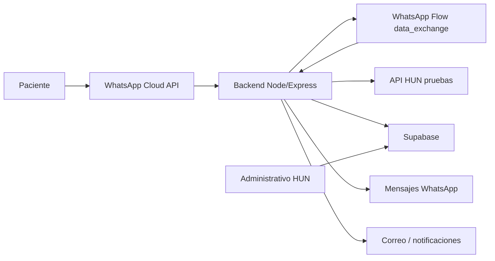

# Plan de cumplimiento - Canal WhatsApp y agendamiento HUN

## Objetivo contractual

Cumplir el contrato de prestacion de servicios mediante un MVP operativo para:

1. Campana de oferta de citas a pacientes: activar demanda inducida, contactar pacientes por WhatsApp y, cuando aplique, complementar por correo.
2. Agendamiento desde WhatsApp Flows: permitir que el paciente se identifique, seleccione especialidad, seleccione cupo, confirme y reciba soporte de trazabilidad.

El alcance se mantiene en el backend del aplicativo hospitalario, la integracion con WhatsApp/Meta, la API HUN de pruebas y la documentacion tecnica. Quedan como trabajo futuro las funciones no maduras o excluidas por contrato, como lectura inteligente de PDF/ordenes medicas y validacion automatica avanzada de adjuntos.

## API HUN explorada

Base URL de pruebas: `http://190.109.10.204`

Header obligatorio:

```http
x-api-key: HospitalUniversitarioNacionaldeColombia
```

Endpoints confirmados por documentacion y prueba viva:

| Funcion | Metodo | Endpoint | Uso en el MVP |
| --- | --- | --- | --- |
| Especialidades | GET | `/webServiceEspecialidad/especialidades` | Poblar el primer selector del Flow. |
| Citas por documento | GET | `/webServiceCitaDocumento/consultar_citas_documento` | Identificar paciente, nombre, EPS/contrato e historial. |
| Cita por numero | GET | `/webServiceCitaNumero/consultar_citas_numero` | Verificar estado de una cita puntual. |
| Citas por medico y fecha | GET | `/webServiceFechaMedico/consultar` | Base para recordatorios, trazabilidad y demanda inducida. |
| Disponibilidad por medico | GET | `/webServiceDisponibilidadMedico/consultar` | Exploracion complementaria por medico. |
| Agenda por especialidad | GET | `/webServiceAgenda/agenda` | Fuente principal de cupos autogestionables para agendar. |
| Asignar cita | POST | `/webServiceCita/api/asignar_cita` | Confirmacion real de cita. |
| Cancelar cita | POST | `/webServiceCancelarCitaH/cancelar_cita` | Cancelacion asincrona. |
| Verificar cancelacion | GET | `/webServiceCancelarCitaH/verificar_cancelacion/{cita}` | Confirmar resultado de cancelacion. |

Hallazgos tecnicos:

- La API devuelve muchos strings con espacios de relleno; el backend debe normalizar con `trim`.
- `webServiceAgenda/agenda` funciona con `cod_especialidad` y `fecha_final`.
- El endpoint de agenda por especialidad devuelve `cups[]`; cada CUPS puede traer su propio `agenda_detalle_id`.
- La asignacion requiere `paciente`, `medico`, `agenda_detalle_id`, `consultorio`, `fecha`, `hora`, `procedimiento`, `tiempo_atencion` y `eps`.
- La cancelacion no es inmediata; se debe registrar estado `procesando` y consultar verificacion posterior.
- La API HUN consumida es una copia/base de pruebas controlada; en este entorno se permite ejecutar asignaciones y cancelaciones para validar el flujo completo.

## Estado local del proyecto

El repo local fue actualizado con `git pull --rebase --autostash`.

Componentes actuales:

- `server.js`: webhook Meta, envio de Flow, endpoint cifrado `/flow-endpoint`, health check y prueba HUN.
- `flow-agendamiento.json`: Flow con pantallas `IDENTIFICACION`, `ESPECIALIDAD`, `SLOTS`, `CONFIRMAR`, `FINAL`.
- `lib/hun.js`: cliente de API HUN para especialidades, agenda, citas por documento y asignacion.
- `lib/flowHandler.js`: orquestacion del Flow, seleccion de cupos, persistencia y confirmacion asincrona.
- `lib/db.js`: persistencia Supabase pendiente de ajustar a almacenamiento minimo no sensible.
- `lib/flowCrypto.js`: cifrado/descifrado requerido por WhatsApp Flows data exchange.
- `lib/whatsapp.js`: mensajes de texto de confirmacion o error.
- `explorar-api-hun.js`: script local de exploracion viva de la API HUN.

Dependencias instaladas:

- `axios`
- `dotenv`
- `express`
- `@supabase/supabase-js`

Variables requeridas en local/Render:

- `VERIFY_TOKEN`
- `WHATSAPP_TOKEN`
- `PHONE_NUMBER_ID`
- `GRAPH_API_VERSION`
- `FLOW_ID`
- `FLOW_SCREEN_ID`
- `FLOW_PRIVATE_KEY_B64`
- `FLOW_KEY_PASSPHRASE`
- `HUN_API_BASE`
- `HUN_API_KEY`
- `HUN_DEMANDA_API_BASE`
- `HUN_DEMANDA_API_AUTH_TYPE`
- `HUN_DEMANDA_API_TOKEN`
- `HUN_DEMANDA_API_ENDPOINT`
- `HUN_DEMANDA_API_TIMEOUT_MS`
- `SUPABASE_URL`
- `SUPABASE_SERVICE_ROLE_KEY`

## Arquitectura objetivo



Responsabilidades:

- WhatsApp/Meta: entrada del paciente, entrega del Flow y ventana conversacional.
- Backend: reglas de negocio, cifrado de Flow, integracion HUN, logs, estados y errores.
- API HUN: fuente de especialidades, cupos, pacientes, EPS, asignacion y cancelacion.
- API oficial de demanda inducida HUN: fuente oficial de audiencia para pacientes a contactar en campanas.
- Supabase: estado temporal minimo del Flow, estados de campana, destinatarios minimos sincronizados desde el API oficial y eventos tecnicos no sensibles.
- Correo/notificaciones: soporte a recordatorios y demanda inducida cuando el contrato lo exija.

## Decision de minimizacion de Supabase

Supabase no sera fuente de verdad clinica ni repositorio de citas. La fuente de verdad para paciente, disponibilidad, cita creada, cita cancelada y estado de cita sera la API HUN.

Supabase solo se usara para lo estrictamente necesario:

- Guardar destinatarios minimos sincronizados desde el API oficial de demanda inducida del hospital.
- Registrar campanas y destinatarios con identificadores minimos.
- Guardar estado temporal del Flow cuando sea necesario para validar la continuidad de la conversacion.
- Registrar eventos tecnicos, metricas no sensibles y estados operativos para trazabilidad diferenciada por perfil.

Supabase no debe almacenar:

- Numero de cita.
- Nombre del paciente.
- Documento plano.
- EPS/contrato.
- Medico.
- Fecha/hora exacta de la cita.
- Procedimiento/CUPS.
- Historia de citas.
- Respuestas completas JSON/SOAP de HUN.
- Ordenes, autorizaciones, adjuntos o datos clinicos.
- Tokens, llaves privadas o service role keys.

Campos minimos permitidos en Supabase:

- Campanas: `id`, `nombre`, `especialidad_codigo`, `mensaje_template_id`, `estado`, conteos agregados, timestamps.
- Destinatarios: `id`, `campaign_id`, `whatsapp_numero`, `tipo_documento`, `documento_hash`, `especialidad_codigo`, `estado_contacto`, timestamps.
- Sesion temporal: `flow_token` o `session_id`, `whatsapp_numero`, `estado`, `especialidad_codigo`, `slot_token` o identificadores tecnicos minimos, `expires_at`, timestamps.
- Eventos: `event_id`, `campaign_id`, `recipient_id`, `session_id_hash`, `event_type`, `status`, `source`, `http_status`, `error_code`, `error_category`, `duration_ms`, `retry_count`, `environment`, `backend_version`, timestamps.

## Decision de trazabilidad y reportes administrativos

La trazabilidad se disenara con dos vistas separadas, siguiendo buenas practicas de auditoria tecnica y minimizacion de datos:

- Vista medica/operativa: orientada a medicos y personal operativo que necesitan entender el avance de campanas y el resultado de contacto, sin ver logs tecnicos ni detalles de cita.
- Vista IT/auditoria: orientada a soporte tecnico y profesionales IT que necesitan diagnosticar integraciones, errores, tiempos de respuesta y estado de servicios, sin acceder a datos clinicos ni payloads sensibles.

Campos recomendados para vista medica/operativa:

- `campaign_id`
- `especialidad_codigo`
- `estado_contacto`
- `ultimo_evento`
- `resultado_operativo`: `cita_agendada`, `sin_cupos`, `paciente_no_responde`, `error_contacto`, `no_interesado`
- `motivo_fallo_simple`
- conteos agregados por campana y especialidad
- tasas agregadas de contactados, respondidos, Flow iniciado y agendados

Campos recomendados para vista IT/auditoria:

- `event_id`
- `correlation_id` o `session_id_hash`
- `campaign_id`
- `recipient_id`
- `event_type`
- `status`
- `source`: `whatsapp`, `flow`, `hun_api`, `campaign_api`, `supabase`, `email`
- `http_status`
- `error_code`
- `error_category`
- `duration_ms`
- `retry_count`
- `environment`
- `backend_version`
- `created_at`
- endpoint logico sin parametros sensibles

No se debe mostrar ni exportar desde Supabase:

- documento plano
- numero de cita
- EPS
- medico asignado
- fecha/hora exacta de la cita
- CUPS/procedimiento
- respuesta HUN completa
- tokens, secretos o llaves

La frase operativa para documentacion contractual sera: "El sistema ofrece trazabilidad operativa y tecnica suficiente para seguimiento, auditoria y soporte, sin persistir datos clinicos ni detalles de cita fuera de la API HUN".

## Decision de fuente de audiencia para demanda inducida

La fuente oficial para la audiencia de campanas sera un API oficial del hospital. Cuando llegue el ticket correspondiente, se debe configurar este API con lo necesario para consumirlo de forma segura:

- Base URL.
- Credencial o mecanismo de autenticacion.
- Endpoint exacto.
- Parametros de filtro.
- Esquema de respuesta.
- Manejo de paginacion, errores y reintentos.
- Reglas de seguridad para no persistir datos sensibles en Supabase.

Si al momento de implementar el ticket el API aun no esta disponible, el flujo se debe desarrollar con un adaptador/mock contractual asumiendo que el API respondera estos campos:

- `nombre_paciente`
- `tipo_documento`
- `numero_documento`
- `cod_especialidad_requerida`
- `numero_telefonico`

En ese escenario, el backend debe usar esos datos solo para armar la campana y contactar al paciente. Supabase solo podra guardar destinatarios minimos, por ejemplo `whatsapp_numero`, `tipo_documento`, `documento_hash`, `especialidad_codigo`, `estado_contacto` y timestamps. No debe guardar `nombre_paciente` ni `numero_documento` plano.

## Decision pendiente sobre correo transaccional

El proveedor o API para correo electronico aun no esta definido completamente. Antes de implementar la integracion real de correo, el plan debe elevar una advertencia operativa y confirmar si HUN entregara SMTP, API institucional o proveedor externo aprobado.

El Flow puede capturar correo para confirmacion, pero Supabase no debe convertirlo en perfil permanente de paciente ni guardarlo en tablas de campana o notificaciones. Mientras la sesion este viva, el backend puede guardar el correo solo como `contacto_email_enc` y `contacto_email_hmac` en `flow_sesiones_temporales`, con `contacto_email_expires_at` igual o menor al vencimiento de la sesion. El correo plano solo puede existir en memoria durante el request o el envio.

Hasta que esa decision exista:

- No se deben quemar credenciales ni asumir proveedor.
- No se debe bloquear el flujo principal de WhatsApp.
- Se permite definir una interfaz/adaptador placeholder que registre notificaciones de correo como pendientes.
- Los registros de `notificaciones` con canal `email` no deben guardar direccion de correo plano ni cuerpo completo del mensaje.
- El ticket anterior a la integracion de correo debe advertir explicitamente que `NOTIF-002` queda condicionado a esta definicion.

## Decision de pruebas sobre API HUN

La API HUN actualmente consumida corresponde a un entorno de pruebas controlado con copia de base de datos. En ese entorno se pueden ejecutar llamados `POST` de asignacion y cancelacion de citas para validar el flujo completo de agendamiento, cancelacion y verificacion.

Esta decision aplica al ambiente de pruebas actual. Si en una fase posterior se cambia a un ambiente productivo o no controlado, se debe reabrir la validacion operativa antes de ejecutar operaciones modificadoras.

## Decision de canal conversacional

El canal conversacional aprobado es WhatsApp Cloud API con WhatsApp Flows y endpoint `data_exchange` cifrado. El backend debe mantener compatibilidad con el protocolo de cifrado de Meta, enviar el Flow desde el webhook de WhatsApp y procesar cada pantalla desde `/flow-endpoint`.

## Decision sobre base tecnica existente

El backend Node/Express actual se mantiene como base del proyecto, pero requiere una refactorizacion temprana de persistencia antes de continuar el desarrollo funcional. El flujo actual debe dejar de guardar en Supabase datos como nombre de paciente, documento plano, EPS, citas, datos de agenda y respuestas HUN. El correo solo queda permitido como contacto cifrado y transitorio de sesion para confirmaciones, nunca como dato plano o permanente.

La refactorizacion debe separar responsabilidades:

- `lib/hun.js`: unica capa para consultar y ejecutar operaciones contra HUN.
- `lib/db.js`: capa Supabase limitada a audiencia, campanas, destinatarios minimos, sesiones temporales, eventos operativos y notificaciones no sensibles.
- `lib/flowHandler.js`: orquestacion del Flow usando datos sensibles solo en memoria durante la operacion, sin persistirlos en Supabase.
- `lib/whatsapp.js`: envio de mensajes sin almacenar contenido sensible de cita.

Ningun desarrollo posterior debe depender de tablas antiguas o propuestas como `pacientes_whatsapp`, `citas_agendadas` o sesiones con payloads completos.

## Plan de trabajo por contrato

### Semana 1 - Cierre de base tecnica y ambiente local

Objetivo: dejar el MVP ejecutable y demostrable en local y preparar despliegue.

Tareas:

- Completar `.env` local con credenciales reales de Meta, Flow, HUN, API oficial de demanda inducida cuando este disponible y Supabase.
- Crear/validar tablas Supabase minimas y no sensibles:
  - `campanas`
  - `campana_destinatarios`
  - `flow_sesiones_temporales`
  - `eventos_operativos`
  - `notificaciones`
- Refactorizar `lib/db.js` y `lib/flowHandler.js` para eliminar persistencia de datos sensibles antes de ampliar el Flow.
- Ajustar `.env.example` y README para todas las variables reales, incluyendo placeholders configurables del API oficial de demanda inducida.
- Validar `npm install`, `npm start`, `/`, `/test-hun` y `node explorar-api-hun.js`.
- Revisar codificacion de textos en README/Flow/codigo, porque hay mojibake visible en algunos archivos.

Evidencia:

- Captura o log de health check.
- Resultado resumido de exploracion API HUN.
- Checklist de variables y tablas.

### Semana 2 - MVP Flow de agendamiento

Objetivo: completar el flujo principal de autoagendamiento.

Tareas:

- Validar Flow en Meta con endpoint `/flow-endpoint`.
- Confirmar llave privada `FLOW_PRIVATE_KEY_B64` y passphrase.
- Probar pantallas:
  - identificacion
  - especialidad
  - disponibilidad
  - confirmacion
  - finalizacion
- Fortalecer reglas:
  - aceptar solo cupos `autogestionable = si`
  - limitar cupos por especialidad para que el Dropdown sea usable
  - mostrar errores cuando no hay cupos
  - bloquear confirmacion si no hay EPS
  - guardar cada transicion como evento tecnico no sensible
- Definir formato de resumen para el paciente y para auditoria.

Evidencia:

- Video/capturas del Flow.
- Registro de eventos no sensibles de una sesion completa, incluyendo asignacion de cita en el entorno HUN de pruebas.
- Diccionario inicial de estados.

Entregable contractual asociado:

- Producto 1.1: MVP funcional inicial con conexion WhatsApp/backend.
- Producto 1.3: diseno de flujo conversacional y mapeo de integracion.

### Semana 3 - Campana de oferta de citas

Objetivo: ofrecer cupos disponibles a pacientes candidatos y medir respuesta.

Tareas:

- Definir fuente de pacientes:
  - API oficial del hospital para demanda inducida.
  - Si no esta disponible, adaptador/mock con `nombre_paciente`, `tipo_documento`, `numero_documento`, `cod_especialidad_requerida` y `numero_telefonico`.
- Crear modelo de campana:
  - nombre
  - especialidad
  - fecha de corte
  - cupos disponibles
  - destinatarios
  - estado por destinatario
- Construir flujo de contacto:
  - mensaje inicial de oferta
  - CTA hacia WhatsApp Flow
  - expiracion del cupo
  - reintentos controlados
  - exclusion por opt-out
- Registrar estados:
  - pendiente
  - enviado
  - entregado
  - respondido
  - flow_iniciado
  - agendado
  - fallido
  - no_interesado
- Preparar primer informe de conectividad y resultados.

Evidencia:

- Campana de prueba con pacientes autorizados.
- Tabla de destinatarios con estados.
- Reporte de mensajes enviados y errores.

Entregable contractual asociado:

- Producto 1.2: configuracion inicial de notificaciones y recordatorios con informe de pruebas.

### Semana 4 - Recordatorios, confirmacion y trazabilidad administrativa

Objetivo: cubrir confirmacion/recordacion y dejar consultable el estado del canal.

Tareas:

- Implementar recordatorios por WhatsApp para citas existentes.
- Definir reglas:
  - ventana de envio
  - numero maximo de intentos
  - respuesta positiva/negativa
  - escalamiento manual
- Implementar logs consultables:
  - vista medica/operativa con campana, especialidad, estado de contacto, resultado y motivo simple de fallo.
  - vista IT/auditoria con evento, fuente, estado tecnico, codigo de error, duracion, reintentos y ambiente.
  - sin documento plano, numero de cita, EPS, medico, fecha/hora exacta, CUPS ni payload HUN.
- Crear consultas administrativas separadas por perfil: vista medica/operativa y vista IT/auditoria.
- Redactar informe mensual 1.

Evidencia:

- Pruebas de mensajes de recordatorio.
- Export o consulta de logs.
- Documento de mapeo de integracion actualizado.

Entregable contractual asociado:

- Cierre Mes 1: productos 1.1, 1.2 y 1.3.

### Semana 5 - Cancelacion y verificacion asincrona

Objetivo: completar la capacidad contractual de cancelacion si la API lo permite.

Tareas:

- Agregar flujo de cancelacion:
  - identificar paciente
  - listar citas activas/reservadas
  - seleccionar cita
  - confirmar cancelacion
  - llamar `/webServiceCancelarCitaH/cancelar_cita`
  - consultar `/verificar_cancelacion/{cita}`
- Registrar estados:
  - cancelacion_solicitada
  - cancelacion_procesando
  - cancelada
  - cancelacion_fallida
- Enviar confirmacion por WhatsApp.

Evidencia:

- Prueba con cita autorizada.
- Log de solicitud y verificacion.

Entregable contractual asociado:

- Producto 2.2: pruebas funcionales de cancelacion.

### Semana 6 - Reagendamiento y demanda inducida avanzada

Objetivo: dejar reagendamiento como flujo funcional si supervisor lo prioriza, o documentarlo como fase futura si no hay endpoint especifico o regla operativa suficiente.

Tareas:

- Disenar reagendamiento como cancelar + nueva asignacion, salvo que HUN entregue endpoint especifico.
- Validar riesgos:
  - perdida del cupo original
  - doble reserva
  - ventanas de confirmacion
  - fallos en cancelacion asincrona
- Mejorar demanda inducida:
  - reglas por especialidad
  - prioridad de pacientes
  - cupos liberados
  - trazabilidad de oferta
- Integrar correo solo si HUN entrega SMTP/API o proveedor aprobado; si no esta definido, elevar advertencia y dejar adaptador placeholder.

Evidencia:

- Matriz de reglas de negocio.
- Pruebas de campana y demanda inducida.
- Decision tecnica sobre reagendamiento.

### Semana 7 - Pruebas integrales, seguridad y estabilidad

Objetivo: producir evidencia formal para aprobacion del supervisor.

Tareas:

- Ejecutar matriz de pruebas:
  - salud del backend
  - webhook Meta
  - Flow ping
  - Flow data_exchange
  - especialidades
  - cupos
  - asignacion en API HUN de pruebas
  - cancelacion en API HUN de pruebas
  - campana
  - recordatorio
  - logs
- Revisar datos personales:
  - no exponer tokens
  - no registrar payloads sensibles completos innecesarios
  - minimizar datos de pacientes
  - proteger service role key
- Preparar soporte de estabilidad:
  - logs de despliegue
  - errores conocidos
  - tiempos de respuesta
  - limites de Meta/HUN

Evidencia:

- Informe de pruebas funcionales.
- Evidencia de despliegue estable.
- Lista de riesgos y mitigaciones.

### Semana 8 - Documentacion final y trabajo futuro

Objetivo: cerrar los entregables de Mes 2.

Tareas:

- Documento tecnico final:
  - arquitectura
  - diagrama de flujo conversacional
  - endpoints
  - variables
  - tablas
  - estados/respuestas
  - reglas de negocio
- Informe final de pruebas:
  - agendamiento
  - confirmacion
  - cancelacion
  - demanda inducida
  - notificaciones
  - estabilidad
- Documento de trabajo futuro:
  - validacion de adjuntos
  - lectura de autorizaciones
  - portal administrativo
  - analitica de campanas
  - integracion institucional definitiva
  - endurecimiento de seguridad
  - manejo de consentimiento y opt-out

Entregables contractuales asociados:

- Producto 2.1: documentacion tecnica, diagrama, reglas y diccionario de estados.
- Producto 2.2: informe final de pruebas funcionales.
- Producto 2.3: requerimientos funcionales y no funcionales para siguientes fases.

## Diccionario inicial de estados

Estados de sesion:

- `identificando`
- `eligiendo_especialidad`
- `eligiendo_slot`
- `confirmando`
- `procesando_asignacion`
- `completado`
- `fallido`
- `cancelacion_solicitada`
- `cancelacion_procesando`
- `cancelada`

Estados de campana:

- `borrador`
- `programada`
- `enviando`
- `activa`
- `cerrada`
- `cancelada`

Estados por destinatario:

- `pendiente`
- `enviado`
- `entregado`
- `leido`
- `respondido`
- `flow_iniciado`
- `agendado`
- `no_interesado`
- `fallido`
- `excluido`

## Riesgos y decisiones necesarias

Riesgos:

- Meta Flows exige cifrado correcto; sin llave privada validada no funciona `data_exchange`.
- Supabase service role no debe exponerse al cliente ni registrarse en logs.
- Supabase no debe almacenar citas ni datos clinicos; HUN sera la fuente de verdad.
- La API HUN de pruebas permite crear y cancelar citas dentro de un entorno controlado; los POST estan permitidos para validacion funcional.
- El endpoint de cancelacion es asincrono; el bot debe manejar espera y verificacion.
- La API devuelve datos personales sensibles; los logs deben minimizar contenido.
- El contrato exige Ley 1581 y confidencialidad; las pruebas deben usar pacientes autorizados.

Decisiones pendientes:

- Configuracion final del API oficial HUN de demanda inducida: base URL, autenticacion, endpoint, filtros, paginacion y formato de respuesta.
- Proveedor o API para correo electronico sigue pendiente; debe resolverse antes de implementar envio real de correo.
- Reportes administrativos se dividen en vista medica/operativa y vista IT/auditoria con campos minimos no sensibles.
- Criterios de seleccion de pacientes para demanda inducida.
- Reglas de opt-out y consentimiento.
- Confirmar antes de produccion las reglas para pasar de API HUN de pruebas a un ambiente productivo o no controlado.

## Proximo bloque de implementacion recomendado

1. Crear esquema Supabase versionado y minimizado para campanas, destinatarios, sesiones temporales y eventos operativos no sensibles.
2. Refactorizar la persistencia actual para que Supabase no reciba nombre, documento plano, EPS, citas ni payloads HUN.
3. Corregir textos con mojibake en README, Flow y mensajes visibles.
4. Agregar trazabilidad estructurada con vista medica/operativa y vista IT/auditoria.
5. Agregar filtro `autogestionable = si` y manejo robusto de `agenda_detalle_id`.
6. Implementar cancelacion como segundo Flow o rama conversacional separada.
7. Implementar modulo de campanas con lectura de audiencia desde API oficial HUN o adaptador/mock contractual si el API aun no esta disponible.
